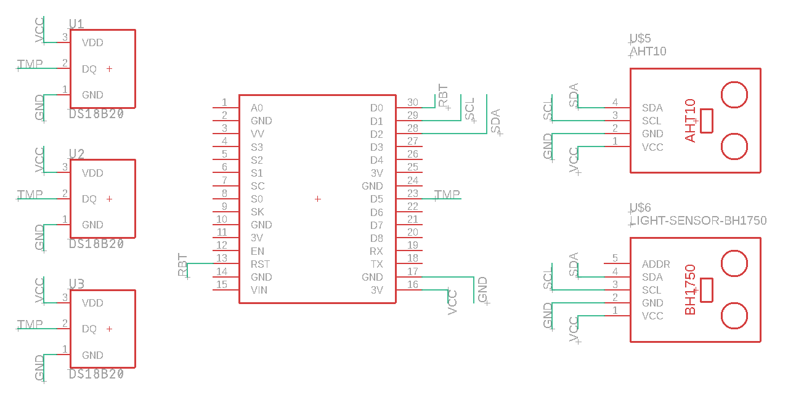

# Potduino

`Smart` flowerpot that connects to Google home API using a [`NodeMCU ESP8266`](https://nodemcu.readthedocs.io/en/release/) as the brains. The project aims to use multiple sensors to monitor the environment to watter the plants located in 3 pots and log that sensor data locally and on a server. Or can just watter the plants on an schedule depending on the configuration. The code used on this project can be found at the [src](src) directory. So as the schematics for the circuit at the [hwd](hwd) directory. Lastly, a dockerfile with the environment used to develop this project can be found at [docker](docker).

The sensors used include:

- [AHT10](https://www.espruino.com/AHT10): environment temperature.
- [BH1750](https://www.espruino.com/BH1750): environment luminosity level.
- [DS18B20 waterproof](https://www.adafruit.com/product/381): Soil temperature.

## Getting Started

### Prerequisities

#### Docker

A dockerfile containing the development environment can be found at [docker/Dockerfile](docker/Dockerfile). In order to build/run this image you'll need to install docker. See installation instructions at[Getting started with docker in Linux](https://docs.docker.com/linux/started/). You cand find specific instructions on how to build/run this docker image at the [docker/README.md](docker/README.md) file.

**Note:** At this time Windows doesn't support mounting UART (COM) ports into a docker container. So if you want to use the image you should run it on a GNU Linux system.

#### Circuit

First you need to build the [circuit](hwd), or you can modify it to fit your requirements.


## Deployment

In order to use the code provided, you'll need to flash latest micropython firmware on your ESP8266. This can be done in a terminal inside of the dev container image (see [docker/README.md](docker/README.md)) like this:

```shell
$ curl -O https://micropython.org/resources/firmware/esp8266-1m-20210418-v1.15.bin
$ mcflashclean
$ mcflash esp8266-1m-20210418-v1.15.bin
```

More information on micropython can be found at [micropython's page](https://docs.micropython.org/en/v1.15/esp8266/tutorial/intro.html).

Then, install the required libraries on the board:

```shell
$ mcput vendor/micropython_ahtx0/ahtx0.py /lib/
$ mcput vendor/upylib/bh1750/__init__.py /lib/bh1750.py
$ mcput vendor/pycopy-lib/logging/logging/__init__.py /lib/logging.py
```

Then, upload the code after doing any modification your hardware requires:

```shell
$ mcput src/firmware/potduino.py
$ mcput src/firmware/pot.py
$ mcput src/firmware/main.py
```

## Author

- **Malcolm Davis** - _Initial-work_ - [potduino](https://github.com/malkam03/potduino)

See also the list of [contributors](https://github.com/malkam03/potduino/contributors.md) who participated in this project.

## License

This project is licensed under the MIT License - see the [LICENSE](LICENSE.md) file for details.

## Acknowledgments
