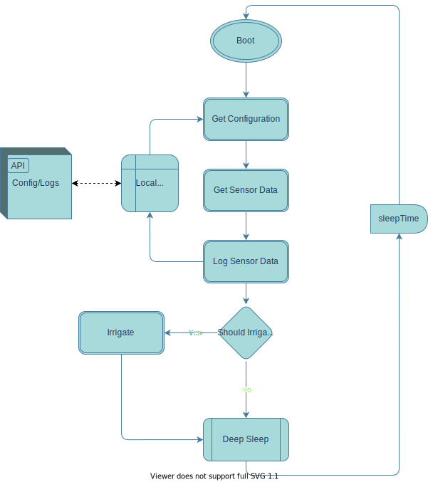

# Potduino Firmware

This folder contains the source code that's uploaded to the `esp8266` to control the behavior of the hardware.
A simplification of the process can be found at the following image:

